# API de Gerenciamento de Pousada

Esta API foi desenvolvida para gerenciar quartos de uma pousada, permitindo a listagem dos quartos, verificação de disponibilidade, filtragem por status e visualização dos detalhes dos hóspedes que estão nos quartos.

## Tecnologias Utilizadas

- **Java**
- **Spring Boot**
- **Spring Data JPA**
- **PostgreSQL**

## Como Executar o Projeto Localmente

Para rodar o projeto localmente, siga os seguintes passos:

1. Clone o repositório na sua máquina:
    ```bash
    git clone https://github.com/RafaelGonzagaFr/gerenciamento-de-pousada
    ```

2. Abra o projeto em sua IDE de preferência (por exemplo, IntelliJ IDEA ou Eclipse).

3. Certifique-se de que o PostgreSQL está instalado e configurado corretamente na sua máquina. Crie um banco de dados para a aplicação.

4. No arquivo `application.properties` ou `application.yml`, configure as credenciais do banco de dados, como segue abaixo:

    ```properties
    spring.datasource.url=jdbc:postgresql://localhost:5432/nome_do_banco
    spring.datasource.username=seu_usuario
    spring.datasource.password=sua_senha
    spring.jpa.hibernate.ddl-auto=update
    spring.jpa.database-platform=org.hibernate.dialect.PostgreSQLDialect
    ```

5. Execute o projeto na sua IDE ou utilizando o comando:

    ```bash
    ./mvnw spring-boot:run
    ```

Agora a API estará rodando localmente e pronta para ser testada!

## Como Executar Testes

Para testar as rotas da API, você pode usar ferramentas como [Postman](https://www.postman.com/) ou [Insomnia](https://insomnia.rest/).


### Exemplo de Requisição POST para criação de um quarto:

```json
{
    "roomNumber": "1"
}
```
### Exemplo de Requisição PUT para inserção de um hóspede em um quarto:

```json
{
	"CPF": "99999999999",
	"name": "teste",
	"gender": "male"
}
```

## Endpoints da API

| Método | Rota                           | Descrição                                         |
|--------|---------------------------------|---------------------------------------------------|
| GET    | /rooms                          | Lista todos os quartos                            |
| GET    | /rooms/available                | Lista todos os quartos desocupados                |
| GET    | /rooms/occupied                 | Lista todos os quartos ocupados                   |
| GET    | /rooms/{id}                     | Retorna detalhes de um quarto específico          |
| POST   | /rooms                          | Cria um novo quarto                               |
| PUT    | /rooms/check-in/{id}            | Registra a entrada de um hóspede no quarto       |
| PUT    | /rooms/check-out/{id}           | Registra a saída de um hóspede do quarto         |
| GET    | /guest/{id}                     | Retorna detalhes de um hóspede        |


## Imagens

### Criar Quarto
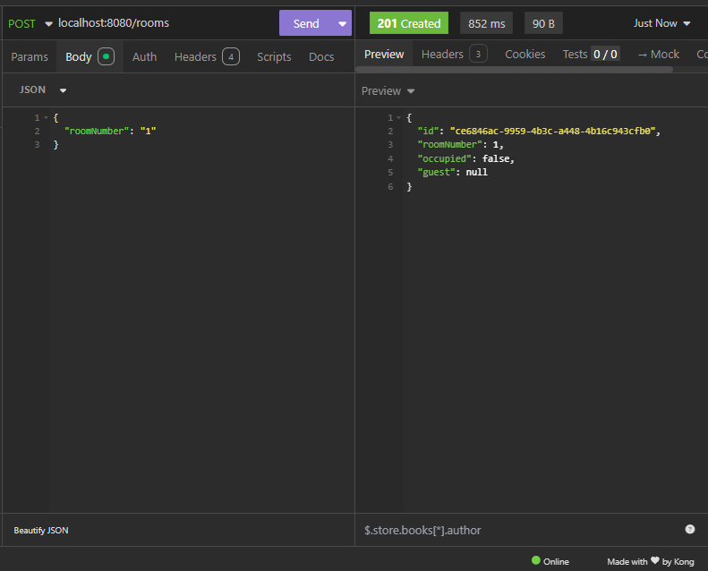

### Número de quarto já existe
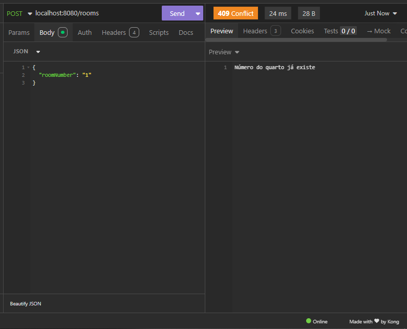

### Retornar todos os quartos 
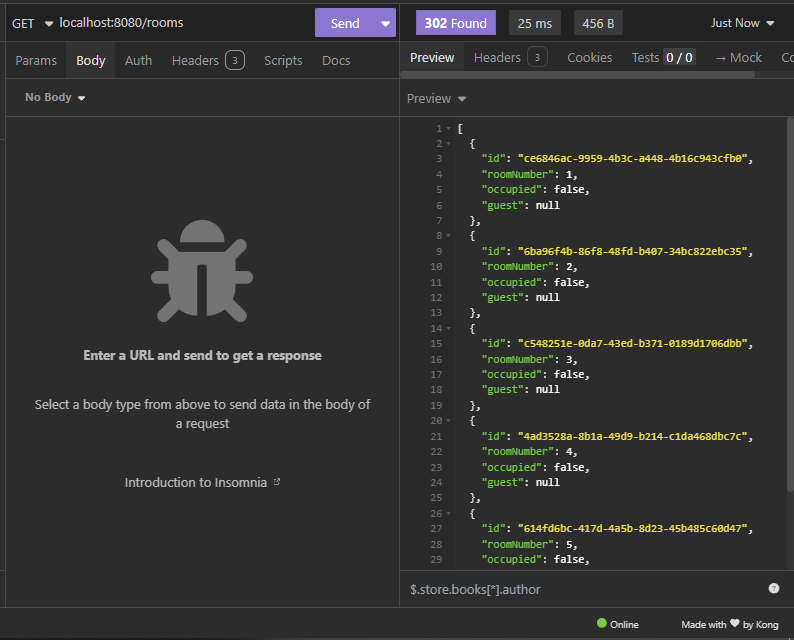

### Fazer check-in
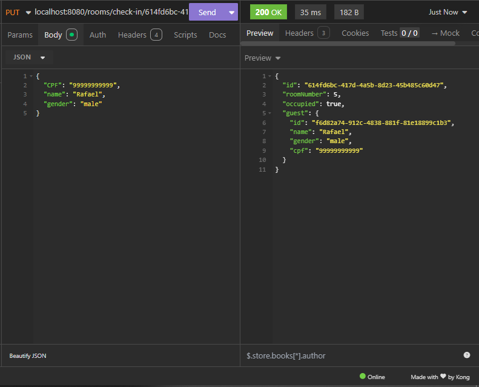

### Erro no check-in CPF já usado
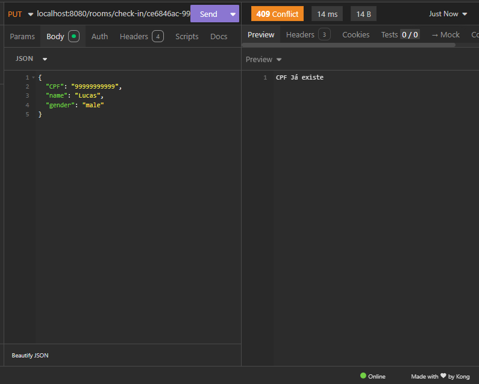

### Erro no check-in quarto não encontrado
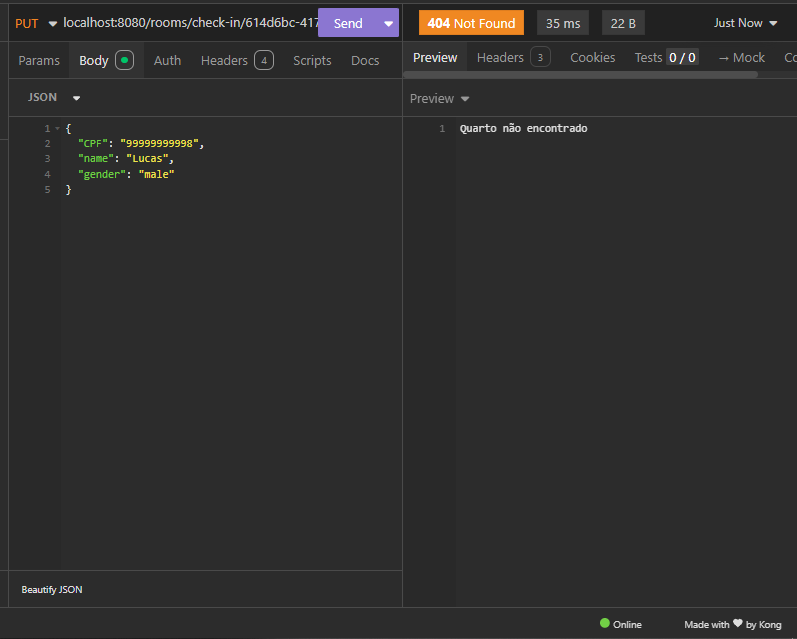

### Erro no check-in quarto já ocupado
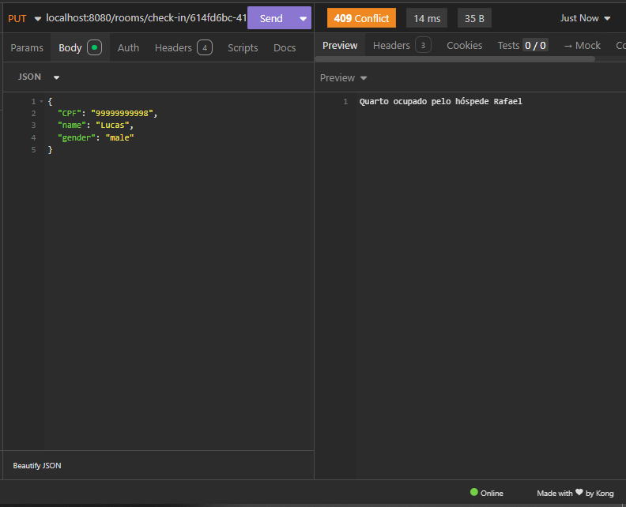

### Retornar todos os quartos disponíveis
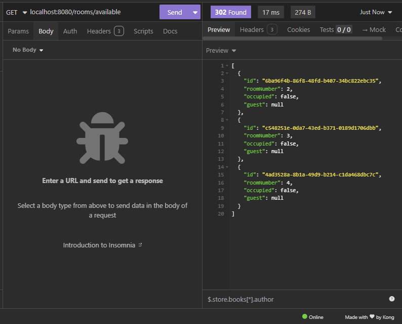

### Retornar todos os quartos ocupados
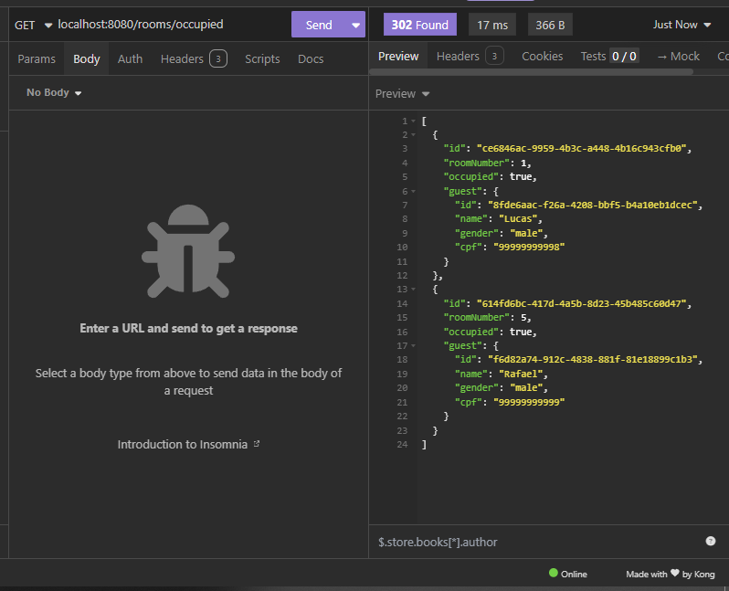

### Retornar hóspede
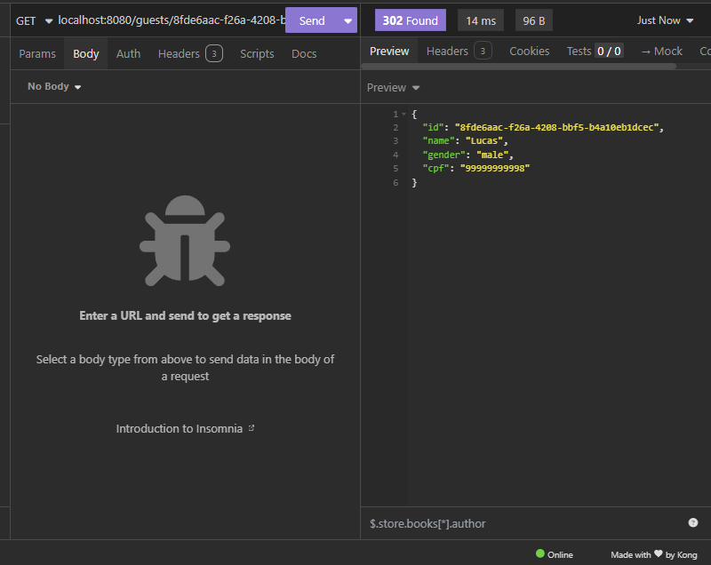

### Retornar quarto por id
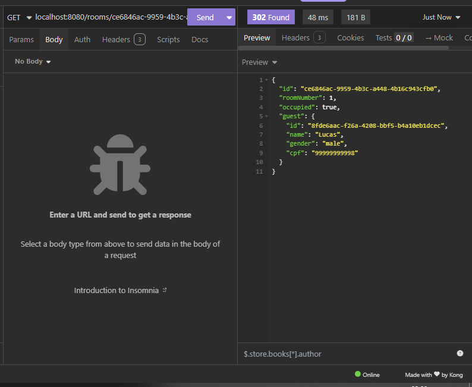


