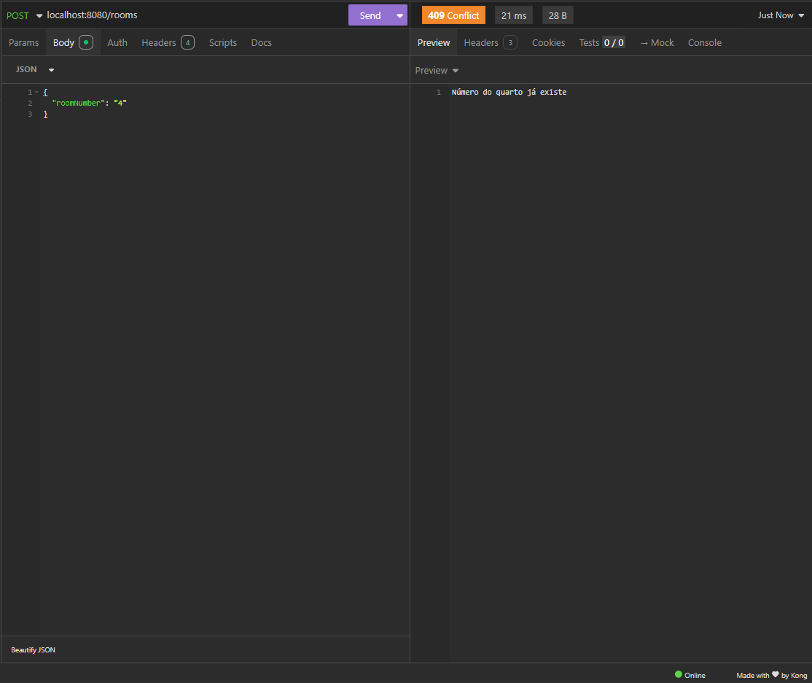

# API de Gerenciamento de Pousada

Esta API foi desenvolvida para gerenciar quartos de uma pousada, permitindo a listagem dos quartos, verificação de disponibilidade, filtragem por status e visualização dos detalhes dos hóspedes que estão nos quartos.

## Tecnologias Utilizadas

- **Java**
- **Spring Boot**
- **Spring Data JPA**
- **PostgreSQL**
- **Docker**

## Como Executar o Projeto Localmente

Para rodar o projeto localmente, siga os seguintes passos:

1. Clone o repositório na sua máquina:
    ```bash
    git clone https://github.com/RafaelGonzagaFr/gerenciamento-de-pousada
    ```

2. Abra o projeto em sua IDE de preferência (por exemplo, IntelliJ IDEA ou Eclipse).

3. Suba os container com o Docker Compose
   
Certifique-se de que o Docker e o Docker Compose estão instalados na sua máquina. No diretório raiz do projeto, onde o arquivo docker-compose.yml está localizado, execute o seguinte comando para iniciar o serviço PostgreSQL:
	```bash
	docker-compose up -d
	```

5. No arquivo `application.properties`, as credenciais já estão configuradas para se conectar ao postgres rodando no docker, porém caso mude algo na configuração do docker compose, o arquivo deverá ser modificado conforme o que for alterado:

    ```properties
    spring.datasource.url=jdbc:postgresql://0.0.0.0:5432/guesthouse_db

	spring.datasource.username=taxiDriver
	spring.datasource.password=areYouTalkingToMe?

	spring.jpa.hibernate.ddl-auto=update
	spring.jpa.database-platform=org.hibernate.dialect.PostgreSQLDialect

	spring.jpa.properties.hibernate.jdbc.lob.non_contextual_creation=true
	spring.jpa.show-sql=true
    ```

6. Execute o projeto na sua IDE ou utilizando o comando:

    ```bash
    ./mvnw spring-boot:run
    ```

7. Parando o Docker Compose:
Quando você terminar de testar a aplicação, o serviço PostgreSQL pode ser parado executando:
	```bash
		docker-compose down
	```


## Como Executar Testes

Para testar as rotas da API, você pode usar ferramentas como [Postman](https://www.postman.com/) ou [Insomnia](https://insomnia.rest/).


### Exemplo de Requisição POST para criação de um quarto:

```json
{
    "roomNumber": "1"
}
```
### Exemplo de Requisição PUT para inserção de um hóspede em um quarto:

```json
{
	"CPF": "99999999999",
	"name": "teste",
	"gender": "male"
}
```

## Endpoints da API

| Método | Rota                            | Descrição                                         |
|--------|---------------------------------|---------------------------------------------------|
| GET    | /rooms                          | Lista todos os quartos                            |
| GET    | /rooms/available                | Lista todos os quartos desocupados                |
| GET    | /rooms/occupied                 | Lista todos os quartos ocupados                   |
| GET    | /rooms/{id}                     | Retorna detalhes de um quarto específico          |
| POST   | /rooms                          | Cria um novo quarto                               |
| PUT    | /rooms/check-in/{id}            | Registra a entrada de um hóspede no quarto        |
| PUT    | /rooms/check-out/{id}           | Registra a saída de um hóspede do quarto          |
| GET    | /guests                         | Retorna todos os hóspedes                         |
| GET    | /guests/{id}                    | Retorna detalhes de um hóspede                    |


## Imagens

### Criar Quarto


### Número de quarto já existe


### Retornar todos os quartos 


### Fazer check-in


### Erro no check-in CPF já usado


### Erro no check-in quarto não encontrado


### Erro no check-in quarto já ocupado


### Retornar todos os quartos disponíveis


### Retornar todos os quartos ocupados


### Retornar todos os hóspedes


### Retornar hóspede


### Retornar quarto por id


### Fazer Check-out


